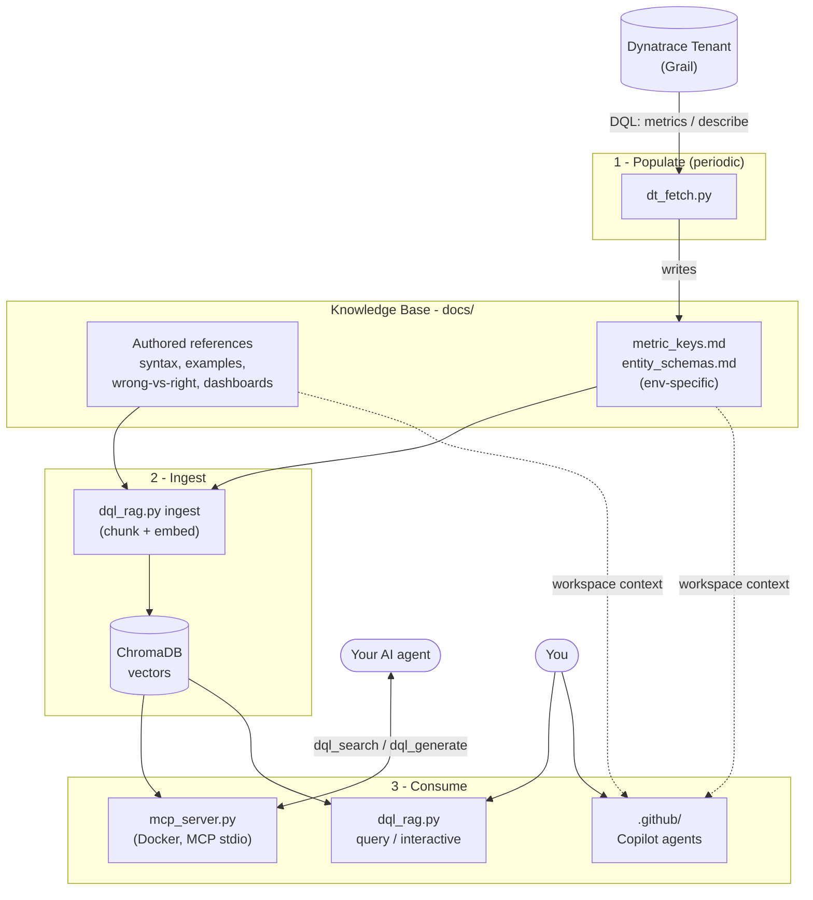
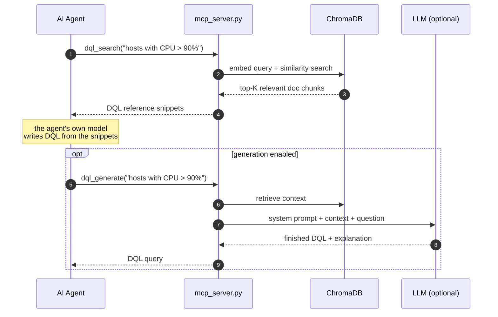

# Architecture & How-To

How the Dynatrace DQL Knowledge Base fits together, and how to run every part of
it. For the quick pitch and feature list, see the [README](README.md).

---

## How it all works

The repo has one job: stop LLMs from hallucinating Dynatrace Query Language. It
does that by keeping a **knowledge base** of correct DQL facts and feeding the
relevant parts to whatever model is writing a query — a Copilot agent, your own
MCP-aware agent, or the bundled RAG CLI.

There are three stages: **populate** the knowledge base, **ingest** it into a
vector store, and **consume** it from an agent.



**1 - Populate.** The generic DQL grammar is authored by hand in `docs/`
(`dql_syntax_reference.md`, `dql_example_queries.md`, …). The two
*environment-specific* files — `metric_keys.md` and `entity_schemas.md` — are
generated from a live tenant by [`dt_fetch.py`](dt_fetch.py), which runs DQL
against the Dynatrace Grail API. Each generated file is stamped with the query
date so you know how fresh it is (see [Data provenance](#data-provenance)).

**2 - Ingest.** `dql_rag.py ingest` chunks every file in `docs/`, embeds the
chunks locally with `all-MiniLM-L6-v2` (no API key needed for embeddings), and
stores them in a local ChromaDB vector database.

**3 - Consume.** Three independent front-ends read the same knowledge base:

- **MCP server** (`mcp_server.py`, shipped as a Docker image) — exposes the KB
  to any MCP-aware agent as tools. This is the primary integration path.
- **RAG CLI** (`dql_rag.py query` / `interactive`) — a standalone terminal tool.
- **GitHub Copilot agents** (`.github/`) — read `docs/` as workspace context;
  no ingest or vector DB involved.

### What a query looks like

The MCP server offers two tools. `dql_search` is pure retrieval (no LLM key);
`dql_generate` adds an LLM call and is only registered when a provider is
configured.



---

## Components

| File / dir | Role | Needs network? |
|------------|------|----------------|
| `docs/` (authored) | Hand-written DQL grammar, examples, wrong-vs-right, dashboard schema | No |
| `docs/metric_keys.md`, `docs/entity_schemas.md` | Env-specific, generated from a live tenant | Generated by `dt_fetch.py` |
| `dt_fetch.py` | Populates the env-specific docs via the Grail query API | Yes (to the tenant) |
| `dql_rag.py` | Chunk + embed + retrieve + (optional) LLM call; CLI | Only for the LLM call |
| `mcp_server.py` | MCP server wrapping retrieval + generation as tools | No (retrieval); yes for `dql_generate` |
| `Dockerfile` | Builds the MCP image; ingests + caches the model at build time | At build only |
| `.github/` | Copilot instructions and `@dql-expert` / `@dashboard-builder` agents | No |
| ChromaDB (`chroma_db/`) | Local vector store, built by `ingest` (gitignored) | No |

---

## How-to

### Prerequisites

- Python 3.12. On Debian/Ubuntu the stdlib venv needs `sudo apt install
  python3-venv python3-pip`, or use [`uv`](https://github.com/astral-sh/uv).
- Docker (for the MCP container path).
- A Dynatrace tenant URL + token (only to populate env-specific docs).

### 1. Populate the environment-specific docs

```bash
cp .env.example .env          # fill in DT_ENVIRONMENT_URL and DT_API_TOKEN
python dt_fetch.py test       # verify auth + connectivity (one tiny query)
python dt_fetch.py all        # write metric_keys.md + entity_schemas.md
```

Token auth scheme is auto-detected: classic API tokens (`dt0c01…`) use
`Api-Token`, platform tokens (`dt0s16…`) use `Bearer`. Required Grail read
scopes are listed in [`.env.example`](.env.example). `.env` is gitignored.

> Skip this step to use the committed sample data as-is — but the metric keys and
> field names will reflect the tenant they were generated from, not yours.

### 2. Integrate with an agent (MCP, recommended)

```bash
docker build -t dql-kb-mcp .
docker run --rm -i dql-kb-mcp        # retrieval only, zero config
```

Register it with your MCP client (Claude Code/Desktop, Cursor, …):

```jsonc
{
  "mcpServers": {
    "dql-kb": {
      "command": "docker",
      "args": ["run", "--rm", "-i", "dql-kb-mcp"]
    }
  }
}
```

Enable the `dql_generate` tool by passing a provider at runtime:

```bash
docker run --rm -i \
  -e LLM_PROVIDER=ollama \
  -e OLLAMA_BASE_URL=http://host.docker.internal:11434 \
  -e OLLAMA_MODEL=qwen3.6:27b \
  dql-kb-mcp
```

### 3. Use the RAG CLI directly

```bash
pip install -r requirements.txt       # or: uv pip install -r requirements.txt
python dql_rag.py ingest
python dql_rag.py query "Show me error logs from the payment service"
python dql_rag.py interactive
```

### 4. Use the Copilot agents

Open the repo in VS Code with Copilot enabled and use `@dql-expert` or
`@dashboard-builder` in Copilot Chat. No build step — Copilot reads `.github/`
and `docs/` as context. See the [README](README.md#github-copilot-agents).

### Refreshing the knowledge base

Metric keys and entity fields drift as a tenant changes. To refresh:

```bash
python dt_fetch.py all                # re-pull env docs (re-stamps the date)
python dql_rag.py ingest              # re-embed (CLI path)
docker build -t dql-kb-mcp .          # rebuild the image (MCP path)
```

`ingest` upserts by content hash, so unchanged chunks are cheap and re-running
is safe.

---

## Data provenance

`docs/metric_keys.md` and `docs/entity_schemas.md` are **generated**, and each
carries a header recording the source tenant and the UTC time it was queried:

```
# Auto-generated by dt_fetch.py from https://<env>.apps.dynatrace.com
# Queried: 2026-06-27 23:01 UTC
```

Treat that timestamp as the freshness of the metric/field data. Re-run
`dt_fetch.py all` to refresh it. The hand-authored docs in `docs/` are not
timestamped — they track the DQL language itself, which changes far more slowly.

If you commit the generated docs to a shared repo, set `DT_REDACT_TENANT=1` so
the header records a placeholder host (`https://<your-env>.apps.dynatrace.com`)
instead of your real tenant URL. The committed samples here were generated that
way.

> Note: a near-empty test tenant will report very few metric keys (only
> `dt.sfm.*` self-monitoring and `dt.billing.*`), because metric keys only exist
> once something is being monitored. Entity/log/span **schemas** still populate
> fully — `dt_fetch.py` uses `describe`, which returns the field list even with
> no data present.
