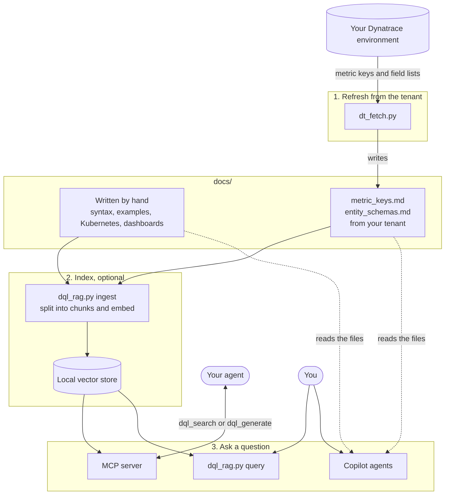
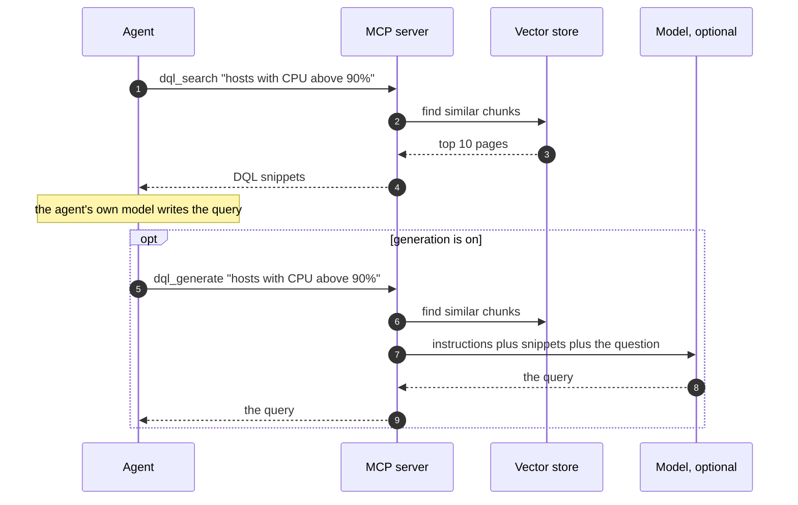

# Architecture and how-to

How the pieces fit, and how to run each one. The short version is the [README](README.md).

---

## How it fits together

The repo keeps correct DQL in `docs/` and hands the relevant pages to whatever model is writing the query.

Copilot reads the files directly. Search and generation go through a local vector store. Only the metric-key refresh and the trace profiler talk to Dynatrace.


```mermaid
flowchart TB
    DT[("Your Dynatrace environment")]

    subgraph populate["1. Refresh from the tenant"]
        FETCH["dt_fetch.py"]
    end
    DT -->|"metric keys and field lists"| FETCH

    subgraph kb["docs/"]
        AUTHORED["Written by hand<br/>syntax, examples, Kubernetes, dashboards"]
        ENVDOCS["metric_keys.md<br/>entity_schemas.md<br/>from your tenant"]
    end
    FETCH -->|writes| ENVDOCS

    subgraph ingest["2. Index, optional"]
        ING["dql_rag.py ingest<br/>split into chunks and embed"]
        CHROMA[("Local vector store")]
    end
    AUTHORED --> ING
    ENVDOCS --> ING
    ING --> CHROMA

    subgraph consume["3. Ask a question"]
        MCP["MCP server"]
        CLI["dql_rag.py query"]
        COPILOT["Copilot agents"]
    end
    CHROMA --> MCP
    CHROMA --> CLI
    AUTHORED -. "reads the files" .-> COPILOT
    ENVDOCS -. "reads the files" .-> COPILOT

    AGENT(["Your agent"]) <-->|"dql_search or dql_generate"| MCP
    USER(["You"]) --> CLI
    USER --> COPILOT
```

| Step | What happens | Talks to the network? |
|------|----------------|------------------------|
| Refresh | `dt_fetch.py` writes metric keys and field names from your tenant. The date is in the file header. | Your tenant only |
| Index | `dql_rag.py ingest` splits `docs/` and stores vectors locally (`all-MiniLM-L6-v2`). No model API key. | Only while downloading the embedder the first time |
| Ask | Copilot reads `docs/` as files. MCP and the CLI search the vector store. | The model call, if you turn generation on |

Copilot does not use the vector store. MCP and `dql_rag.py` do.

### What a question does

`dql_search` only retrieves. `dql_generate` is registered when a provider is set, and it writes the query.


```mermaid
sequenceDiagram
    autonumber
    participant A as Agent
    participant M as MCP server
    participant C as Vector store
    participant L as Model, optional

    A->>M: dql_search "hosts with CPU above 90%"
    M->>C: find similar chunks
    C-->>M: top 10 pages
    M-->>A: DQL snippets
    Note over A: the agent's own model writes the query

    opt generation is on
        A->>M: dql_generate "hosts with CPU above 90%"
        M->>C: find similar chunks
        M->>L: instructions plus snippets plus the question
        L-->>M: the query
        M-->>A: the query
    end
```

---

## Components

| File | Role | Network |
|------|------|---------|
| `docs/` (written by hand) | Syntax, examples, Kubernetes, wrong-vs-right, dashboard schema | No |
| `docs/metric_keys.md`, `docs/entity_schemas.md` | From your tenant | Written by `dt_fetch.py` |
| `dt_fetch.py` | Pulls those two files from the Grail query API | Your tenant |
| `dql_agent.py` | Bedrock model with tools: keyword search over `docs/`, exact name lookup, and DQL runs through `dt_fetch.py`'s client. Standard library only | Bedrock and your tenant |
| `util/` | Trace profiler. Same client as `dt_fetch.py`. Not in the Docker image | Your tenant |
| `dql_rag.py` | Index, search, and an optional model call | The model call only |
| `mcp_server.py` | Same search and generation, as MCP tools | Generation only |
| `Dockerfile` | Builds the MCP image and indexes `docs/` at build time | At build only |
| `.github/` | Copilot instructions and the two agents | No |
| `chroma_db/` | Local vector store from `ingest`. Gitignored | No |

---

## How-to

### Prerequisites

- Python 3.10 or newer, already installed. No admin rights and no `pip install` for the Dynatrace tools. `./quickstart.sh` finds it, including on Windows Git Bash where `python3` is the Microsoft Store alias.
- A Dynatrace platform URL and token, only if you want to refresh the env-specific docs or run the trace profiler.
- Docker, or permission to download from PyPI and Hugging Face, only for the MCP server and the RAG CLI.

### 1. Refresh metric keys and field names

```bash
cp .env.example .env          # fill in DT_ENVIRONMENT_URL and DT_API_TOKEN
./dt_fetch.sh test            # verify auth + connectivity (one tiny query)
./dt_fetch.sh all             # write metric_keys.md + entity_schemas.md
```

Token auth scheme is auto-detected: classic API tokens (`dt0c01…`) use
`Api-Token`, platform tokens (`dt0s16…`) use `Bearer`. Required Grail read
scopes are listed in [`.env.example`](.env.example). `.env` is gitignored.

> Skip this step to use the committed sample data as-is — but the metric keys and
> field names will reflect the tenant they were generated from, not yours.

### 2. Integrate with an agent (MCP, recommended)

```bash
docker build -t dql-kb-mcp .
docker run --rm -i dql-kb-mcp        # retrieval only, zero config
```

Register it with your MCP client (Claude Code/Desktop, Cursor, …):

```jsonc
{
  "mcpServers": {
    "dql-kb": {
      "command": "docker",
      "args": ["run", "--rm", "-i", "dql-kb-mcp"]
    }
  }
}
```

With no provider set, the server offers `dql_search` only. The IDE model, following `@dql-expert` or `@dashboard-builder`, writes the DQL. To turn on `dql_generate`, point it at Bedrock's Converse API or at a private server (`ollama`, `vllm`, or `openai_compatible`). Ollama is called on native `/api/chat` with `OLLAMA_NUM_CTX` (default 16384); vLLM and `openai_compatible` use `/v1/chat/completions`. The 2026-09-24 model comparison and the test plan are in [evaluations/ollama-dql.md](evaluations/ollama-dql.md). Bedrock looks like this:

```bash
docker run --rm -i \
  -e LLM_PROVIDER=bedrock \
  -e BEDROCK_REGION=us-east-1 \
  -e BEDROCK_MODEL_ID=us.anthropic.claude-sonnet-4-5-20250929-v1:0 \
  -e AWS_REGION=us-east-1 \
  -e AWS_ACCESS_KEY_ID -e AWS_SECRET_ACCESS_KEY -e AWS_SESSION_TOKEN \
  dql-kb-mcp
```

### 3. Use the RAG CLI directly

```bash
pip install -r requirements.txt       # or: uv pip install -r requirements.txt
python dql_rag.py ingest
python dql_rag.py query "Show me error logs from the payment service"
python dql_rag.py interactive
```

### 4. Profile trace entry points (utility)

`util/` holds tools that talk to a tenant but are not part of the knowledge base. The trace profiler reuses `dt_fetch.py`'s client and the same `.env`.

```bash
./util/dt_trace_profiler.sh --days 1 --shape-top 5   # cheap first run
./util/dt_trace_profiler.sh --help
```

The CSV it writes contains real service and endpoint names and is gitignored. See [util/README.md](util/README.md) for stages, scoring, and caveats.

### 5. Ask your tenant through Bedrock

```bash
./dql_agent.sh --check
./dql_agent.sh
```

No install. Each question is a loop of Converse calls: the model calls `search_docs`, `find_names` and `run_dql` until it can answer, at most 10 rounds. `run_dql` asks before it runs, caps the scan at `DQL_AGENT_SCAN_LIMIT_GB`, and returns Grail's error text so the model can fix the query. See the [README](README.md#ask-your-tenant-through-bedrock).

### 6. Use the Copilot agents

Open the repo in VS Code with Copilot enabled and use `@dql-expert` or
`@dashboard-builder` in Copilot Chat. No build step — Copilot reads `.github/`
and `docs/` as context. See the [README](README.md#github-copilot-agents).

### Refreshing the knowledge base

Metric keys and entity fields drift as a tenant changes. To refresh:

```bash
python dt_fetch.py all                # re-pull env docs (re-stamps the date)
python dql_rag.py ingest              # re-embed (CLI path)
docker build -t dql-kb-mcp .          # rebuild the image (MCP path)
```

`ingest` skips chunks whose text did not change, so re-running it is safe.

---

## Where the generated files come from

`docs/metric_keys.md` and `docs/entity_schemas.md` are generated. Each header
records the tenant and the UTC time of the query:

```
# Auto-generated by dt_fetch.py from https://<env>.apps.dynatrace.com
# Queried: 2026-06-27 23:01 UTC
```

Treat that timestamp as the freshness of the metric/field data. Re-run
`dt_fetch.py all` to refresh it. The hand-authored docs in `docs/` are not
timestamped — they track the DQL language itself, which changes far more slowly.

If you commit the generated docs to a shared repo, set `DT_REDACT_TENANT=1` so
the header records a placeholder host (`https://<your-env>.apps.dynatrace.com`)
instead of your real tenant URL. The committed samples here were generated that
way.

> Note: a near-empty test tenant will report very few metric keys (only
> `dt.sfm.*` self-monitoring and `dt.billing.*`), because metric keys only exist
> once something is being monitored. Entity/log/span **schemas** still populate
> fully — `dt_fetch.py` uses `describe`, which returns the field list even with
> no data present.
