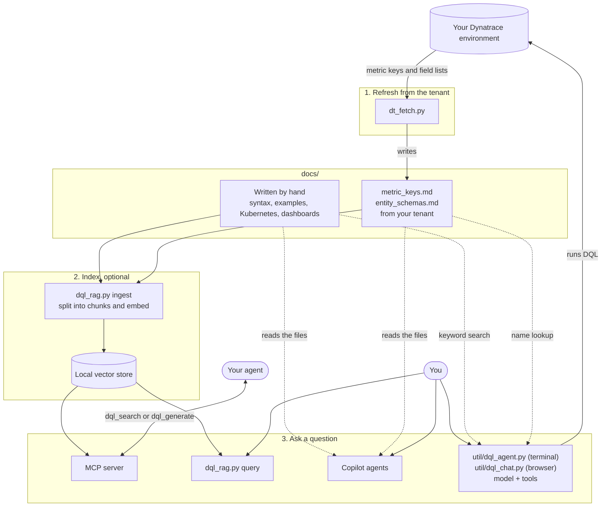
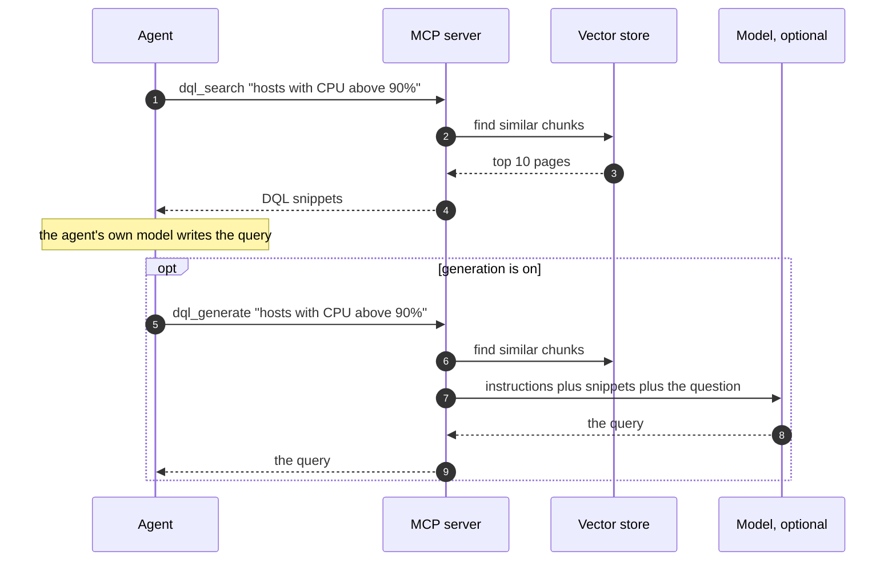
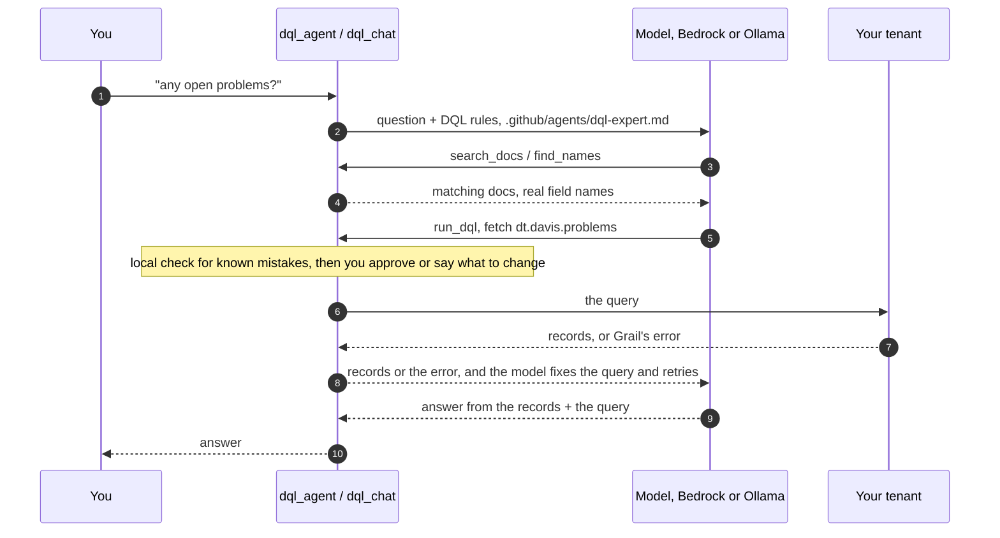

# Architecture

How the pieces fit together. To install and run them, start with the [README](README.md); each tool in `util/` has its own guide.

---

## How it fits together

The repo keeps correct DQL in `docs/` and hands the relevant pages to whatever model is writing the query.

Copilot and the DQL agent read the files directly. Search and generation in `dql_rag.py` and the MCP server go through a local vector store. These talk to Dynatrace: the metric-key refresh, the trace profiler, the incident brief, and the DQL agent, which runs the queries it writes.


```mermaid
flowchart TB
    DT[("Your Dynatrace environment")]

    subgraph populate["1. Refresh from the tenant"]
        FETCH["dt_fetch.py"]
    end
    DT -->|"metric keys and field lists"| FETCH

    subgraph kb["docs/"]
        AUTHORED["Written by hand<br/>syntax, examples, Kubernetes, dashboards"]
        ENVDOCS["metric_keys.md<br/>entity_schemas.md<br/>from your tenant"]
    end
    FETCH -->|writes| ENVDOCS

    subgraph ingest["2. Index, optional"]
        ING["dql_rag.py ingest<br/>split into chunks and embed"]
        CHROMA[("Local vector store")]
    end
    AUTHORED --> ING
    ENVDOCS --> ING
    ING --> CHROMA

    subgraph consume["3. Ask a question"]
        MCP["MCP server"]
        CLI["dql_rag.py query"]
        COPILOT["Copilot agents"]
        DQLAGENT["util/dql_agent.py (terminal)<br/>util/dql_chat.py (browser)<br/>model + tools"]
    end
    CHROMA --> MCP
    CHROMA --> CLI
    AUTHORED -. "reads the files" .-> COPILOT
    ENVDOCS -. "reads the files" .-> COPILOT

    AGENT(["Your agent"]) <-->|"dql_search or dql_generate"| MCP
    USER(["You"]) --> CLI
    USER --> COPILOT
    USER --> DQLAGENT
    AUTHORED -. "keyword search" .-> DQLAGENT
    ENVDOCS -. "name lookup" .-> DQLAGENT
    DQLAGENT -->|"runs DQL"| DT
```

| Step | What happens | Talks to the network? |
|------|----------------|------------------------|
| Refresh | `dt_fetch.py` writes metric keys and field names from your tenant. The date is in the file header. | Your tenant only |
| Index | `dql_rag.py ingest` splits `docs/` and stores vectors locally (`all-MiniLM-L6-v2`). No model API key. | Only while downloading the embedder the first time |
| Ask | Copilot reads `docs/` as files. MCP and the CLI search the vector store. The DQL agent searches `docs/` by keyword and runs its queries on the tenant. | The model call, if you turn generation on. The DQL agent also calls Bedrock and your tenant |

Copilot and the DQL agent do not use the vector store. MCP and `dql_rag.py` do.

### What a question does

`dql_search` only retrieves. `dql_generate` is registered when a provider is set, and it writes the query.


```mermaid
sequenceDiagram
    autonumber
    participant A as Agent
    participant M as MCP server
    participant C as Vector store
    participant L as Model, optional

    A->>M: dql_search "hosts with CPU above 90%"
    M->>C: find similar chunks
    C-->>M: top 10 pages
    M-->>A: DQL snippets
    Note over A: the agent's own model writes the query

    opt generation is on
        A->>M: dql_generate "hosts with CPU above 90%"
        M->>C: find similar chunks
        M->>L: instructions plus snippets plus the question
        L-->>M: the query
        M-->>A: the query
    end
```

### What a question to the chat does


```mermaid
sequenceDiagram
    autonumber
    participant U as You
    participant G as dql_agent / dql_chat
    participant B as Model, Bedrock or Ollama
    participant T as Your tenant

    U->>G: "any open problems?"
    G->>B: question + DQL rules, .github/agents/dql-expert.md
    B->>G: search_docs / find_names
    G-->>B: matching docs, real field names
    B->>G: run_dql, fetch dt.davis.problems
    Note over G: local check for known mistakes, then you approve or say what to change
    G->>T: the query
    T-->>G: records, or Grail's error
    G-->>B: records or the error, and the model fixes the query and retries
    B-->>G: answer from the records + the query
    G-->>U: answer
```

---

## Components

| File | Role | Network |
|------|------|---------|
| `docs/` (written by hand) | Syntax, examples, Kubernetes, wrong-vs-right, dashboard schema | No |
| `docs/metric_keys.md`, `docs/entity_schemas.md` | From your tenant | Written by `dt_fetch.py` |
| `dt_fetch.py` | Pulls those two files from the Grail query API | Your tenant |
| `util/dql_agent.py` | Terminal front end of the agent: keyword search over `docs/`, exact name lookup, and DQL runs through `dt_fetch.py`'s client. Standard library only | The model and your tenant |
| `util/dql_chat.py` | Browser front end of the same agent, with charts and graphs drawn from query results. The container is [`util/dql_chat.Dockerfile`](util/dql_chat.Dockerfile); how to run it is in [Deploy the container on AWS](util/dql_chat.md#deploy-the-container-on-aws) | The model and your tenant |
| `util/dqlagent/` | The agent itself: `core` (tools and loop), `llm` (Bedrock, OpenAI-compatible, Ollama and Anthropic adapters), `aws` (credentials and SigV4, no boto3), `visuals` (chart and graph specs), `web` (chat server), `store` (chat history and per-user settings in SQLite), `static/` (the page, with React Flow vendored) | — |
| `util/dt_trace_profiler.py` | Trace profiler. Same client as `dt_fetch.py`. Not in the Docker image | Your tenant |
| `util/dt_incident.py` | Entity resolver and incident brief. Same client as `dt_fetch.py`. Not in the Docker image | Your tenant |
| `dql_rag.py` | Index, search, and an optional model call | The model call only |
| `mcp_server.py` | Same search and generation, as MCP tools | Generation only |
| `Dockerfile` | Builds the MCP image and indexes `docs/` at build time | At build only |
| `.github/` | Copilot instructions and the two agents | No |
| `chroma_db/` | Local vector store from `ingest`. Gitignored | No |

---

## The DQL agent

`util/dqlagent/` is one agent with two front ends: `dql_agent.py` in the terminal and `dql_chat.py` in the browser.

- **Loop.** Each question is a loop of model calls (at most 10). The model calls `search_docs` (keyword search over `docs/`), `find_names` (exact lookup in the tenant's metric keys and fields) and `run_dql` until it can answer. Every call carries `.github/agents/dql-expert.md` as its DQL rules.
- **Guards.** `run_dql` rejects the known mistakes (SQL keywords, `fetch` on a metric, `by:` without braces) before Grail sees them. It asks before it runs, caps the scan at `DQL_AGENT_SCAN_LIMIT_GB`, and returns Grail's error text so the model can fix the query.
- **Models.** Adapters in `llm.py` cover Bedrock (Converse API, signed with SigV4 in `aws.py`, no `boto3`), Ollama (native `/api/chat`, streamed), OpenAI-compatible servers and the Anthropic API.
- **Charts and graphs.** The browser adds `show_timeseries`, `show_bar` and `show_graph`. They take the `result_id` of a query the model ran plus field names. `visuals.py` builds the chart or graph from that result's records, and the page draws it with SVG or React Flow, so the model never supplies the numbers.
- **History.** `store.py` keeps each chat in SQLite, scoped to its user: the events the page drew (to redraw it) and the agent's messages and query results (so the model carries on after a restart).
- **Stop.** An answer runs on its own thread, so Stop ends it at once. A stopped answer is set aside and cannot reach the page or the history.

Setup and daily use: [util/dql_agent.md](util/dql_agent.md) and [util/dql_chat.md](util/dql_chat.md).

## Copilot

Copilot reads these files as context; there is no build step.

| File | When it applies |
|------|-----------------|
| `.github/copilot-instructions.md` | Every Copilot request |
| `.github/instructions/dql.instructions.md` | Editing `.dql` or `.md` files |
| `.github/instructions/dashboard.instructions.md` | Editing dashboard JSON |
| `.github/agents/dql-expert.md`, `dashboard-builder.md` | `@dql-expert`, `@dashboard-builder` in Chat; the DQL agent uses `dql-expert.md` too |

In Agent Mode, Copilot can also search `docs/`.

## Retrieval and generation

The MCP server and `dql_rag.py` search a local vector store built from `docs/` by `dql_rag.py ingest`. `ingest` skips chunks whose text has not changed, so re-running it is cheap. `dql_generate` and `dql_rag.py query` also call a model when `LLM_PROVIDER` is set (examples in [.env.example](.env.example)):

- **Bedrock** uses the standard AWS credential chain; pass `AWS_*` into the container with `-e`. `BEDROCK_MODEL_ID` is usually a cross-region inference profile (`us.` or `eu.`), not the bare model id.
- **Ollama** is called on its native `/api/chat`, because its `/v1` route ignores `num_ctx` and silently drops the retrieved pages. From Docker on Linux, add `--add-host=host.docker.internal:host-gateway`. Which tag to run is in [evaluations/ollama-dql.md](evaluations/ollama-dql.md).
- **vLLM and other OpenAI-compatible servers** take a base URL with or without `/v1`. Set `PRIVATE_API_KEY` only if the server checks a bearer token.

| Setting | Default | Notes |
|---------|---------|-------|
| `EMBEDDING_MODEL` | `all-MiniLM-L6-v2` | Local sentence-transformer, baked into the image |
| `CHUNK_SIZE` / `CHUNK_OVERLAP` | `800` / `100` | Tokens |
| `TOP_K` | `10` | Chunks retrieved per question |
| `OLLAMA_MODEL` / `OLLAMA_NUM_CTX` | `qwen3:8b` / `16384` | Ollama's default context of 4096 truncates the prompt |

Without Docker, `./quickstart.sh --with-rag` creates `.venv` with the CPU build of PyTorch (a plain `pip install` pulls the multi-gigabyte CUDA build). On Debian or Ubuntu it needs `python3-venv`. With `uv`, run `uv venv && uv pip install -r requirements.txt && uv run python dql_rag.py ingest`.

---

## Where the generated files come from

`docs/metric_keys.md` and `docs/entity_schemas.md` are generated. Each header
records the tenant and the UTC time of the query:

```
# Auto-generated by dt_fetch.py from https://<env>.apps.dynatrace.com
# Queried: 2026-06-27 23:01 UTC
```

Treat that timestamp as the freshness of the metric/field data. Re-run
`dt_fetch.py all` to refresh it. The hand-authored docs in `docs/` are not
timestamped — they track the DQL language itself, which changes far more slowly.

If you commit the generated docs to a shared repo, set `DT_REDACT_TENANT=1` so
the header records a placeholder host (`https://<your-env>.apps.dynatrace.com`)
instead of your real tenant URL. The committed samples here were generated that
way.

> Note: a near-empty test tenant will report very few metric keys (only
> `dt.sfm.*` self-monitoring and `dt.billing.*`), because metric keys only exist
> once something is being monitored. Entity/log/span **schemas** still populate
> fully — `dt_fetch.py` uses `describe`, which returns the field list even with
> no data present.

To refresh everything after the tenant changes: `./dt_fetch.sh all`, then `python dql_rag.py ingest` (CLI) or `docker build -t dql-kb-mcp .` (MCP).
