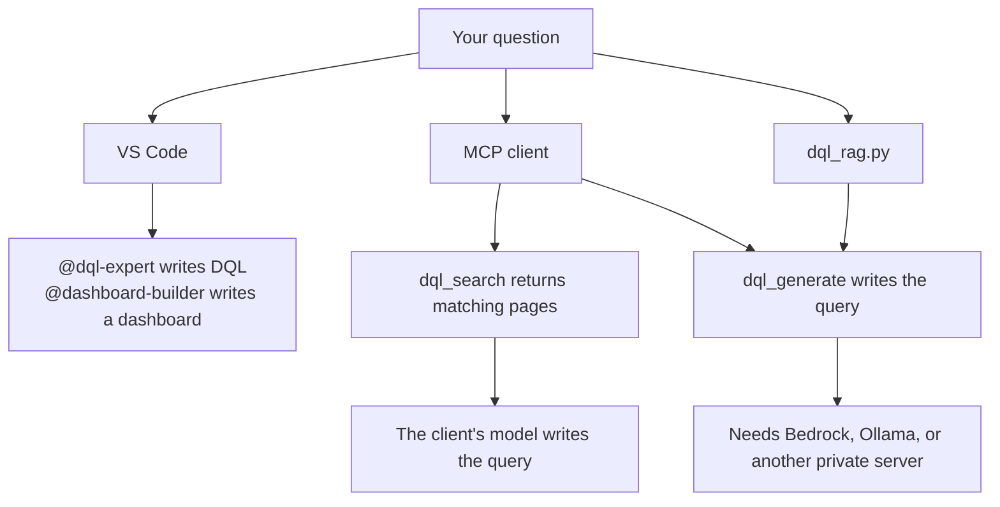
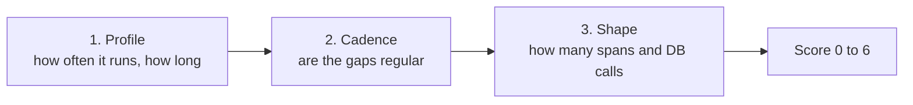

# Dynatrace DQL Knowledge Base

Models often write DQL that Dynatrace rejects: `fetch` on a metric, `by:` without braces, SQL keywords, made-up metric keys. This repo is the reference that keeps the query valid.

Use it from VS Code, from any MCP client, or from the command line. [ARCHITECTURE.md](ARCHITECTURE.md) is the map and the how-to.



## Start here

Built for a desktop you do not administer: a bank or an insurer, where `pip install` and Docker Hub are blocked. The tools that talk to Dynatrace use the Python standard library. They do not need a virtualenv.

```bash
git clone https://github.com/aachtenberg/dynatrace-dql-kb.git
cd dynatrace-dql-kb
./quickstart.sh
```

`./quickstart.sh` only checks that Python 3.10+ actually starts. On Windows Git Bash that is `python` or `py -3`. The `python3` command there is often the Microsoft Store alias, and the scripts skip it.

What works with no install and no outbound network except your Dynatrace tenant:

| You want | Command |
|----------|---------|
| Copilot agents | Open the folder in VS Code. Nothing else. |
| Your tenant's metric keys and field names | `./dt_fetch.sh test` then `./dt_fetch.sh all` |
| Trace entry points that look like batch jobs | `./util/dt_trace_profiler.sh --days 1 --shape-top 5 --min-runs 10 --max-runs 500` |

Copy `.env.example` to `.env` first. `DT_ENVIRONMENT_URL` must be `https://<env-id>.apps.dynatrace.com` with no path. `https://<env-id>.live.dynatrace.com` returns 404 on the Grail query API. Use a platform token (`dt0s16`) created in that same environment. A corporate proxy is honored via `HTTPS_PROXY`. If TLS inspection fails certificate checks, set `SSL_CERT_FILE` to your company CA bundle.

| Path | Who writes the DQL | Install |
|------|--------------------|---------|
| Copilot agents | The model in the IDE | None |
| `dql_search` | The client's model, using the snippets | Docker, or `./quickstart.sh --with-rag` |
| `dql_generate` and `dql_rag.py query` | The model you name | Same, plus Bedrock, Ollama, or another private server |

This repo does not call a public model API unless you point it at one. vLLM and most private servers use `POST /v1/chat/completions`. Ollama is called on its own `/api/chat`, because its `/v1` route ignores the context-window setting and drops the retrieved pages. Which Ollama tag to run is in [evaluations/ollama-dql.md](evaluations/ollama-dql.md). That file stays out of `docs/` so ingest does not treat the bake-off as DQL reference.

Search and generation download PyTorch and an embedding model, so build them where PyPI and Hugging Face are allowed, then copy the image or the `.venv` across. After the image is built it runs with no network. Generation stays off until you set a provider.

## GitHub Copilot Agents

Open this repo in VS Code with Copilot enabled. Two agents are available in Copilot Chat:

### `@dql-expert`
Writes syntactically correct DQL queries. Knows the critical rules that LLMs always get wrong:
- Metrics use `timeseries`, never `fetch`
- `by:` requires curly braces: `by:{host.name}`
- No SQL syntax — DQL is pipe-based
- `makeTimeseries` is only for logs/events/spans, not metrics
- All common metric keys, aggregation functions, string functions, etc.

```
@dql-expert show me hosts with CPU above 90% in the last hour
@dql-expert error logs from the payment service grouped by host
@dql-expert week-over-week CPU comparison
```

### `@dashboard-builder`
Writes a current-format dashboard as JSON. That is the Dashboards app, not a Classic dashboard. It knows the tile types, the grid, and Terraform `dynatrace_document`.

```
@dashboard-builder create a host overview dashboard with CPU, memory, and error logs
@dashboard-builder add a single-value tile showing total error count
```

### How it works
Copilot picks up context from three layers in this repo:

| Layer | File | Scope |
|-------|------|-------|
| Global instructions | `.github/copilot-instructions.md` | Attached to every Copilot request |
| File-type instructions | `.github/instructions/dql.instructions.md` | Applied when editing `.dql` or `.md` files |
| File-type instructions | `.github/instructions/dashboard.instructions.md` | Applied when editing dashboard JSON |
| Agents | `.github/agents/dql-expert.md` | Invoked with `@dql-expert` in Chat |
| Agents | `.github/agents/dashboard-builder.md` | Invoked with `@dashboard-builder` in Chat |

The `docs/` directory also serves as searchable workspace context when Copilot Chat is in Agent Mode.

## Knowledge Base

The `docs/` directory contains DQL reference material:

| File | What's in it |
|------|-------------|
| `dql_syntax_reference.md` | Commands, functions, operators, data types — the full language reference |
| `dql_example_queries.md` | Working queries: hosts, logs, spans, Kubernetes, entities |
| `kubernetes.md` | Container CPU, restarts, and how to tell a cluster is k3s |
| `dql_tips_and_patterns.md` | Common mistakes and how to avoid them |
| `dql_wrong_vs_right.md` | 17 explicit wrong→right pairs for every hallucination LLMs produce |
| `dashboard_json_schema.md` | Grail dashboard JSON format, tile types, visualizations, Terraform |
| `metric_keys.md` | **Your environment's** metric keys (populate from Notebooks — see below) |
| `entity_schemas.md` | **Your environment's** entity/log/span field schemas (populate from Notebooks) |

### Populate with your environment data

The generic DQL grammar is complete, but LLMs will still hallucinate **metric keys** and **field names** because those are environment-specific. Populate the two placeholder docs (`docs/metric_keys.md`, `docs/entity_schemas.md`) from your live tenant.

#### Automated — `dt_fetch.py` (recommended)

Queries the Dynatrace Grail API directly and writes both docs. Stdlib only — no extra dependencies.

```bash
cp .env.example .env          # then fill in DT_ENVIRONMENT_URL and DT_API_TOKEN
./dt_fetch.sh test            # verify token + connectivity (one tiny query)
./dt_fetch.sh all             # populate metric_keys.md + entity_schemas.md
# or individually: ./dt_fetch.sh metrics | ./dt_fetch.sh schemas
```

`./dt_fetch.sh` is a thin wrapper around `dt_fetch.py`. It finds a working Python and forwards every argument. No packages are installed.

`.env` config (also read from real environment variables):

| Variable | Example | Notes |
|----------|---------|-------|
| `DT_ENVIRONMENT_URL` | `https://abc12345.apps.dynatrace.com` | Platform/apps URL, no trailing slash |
| `DT_API_TOKEN` | `dt0c01...` or `dt0s16...` | Auth scheme auto-detected: classic API token (`dt0c01`) → `Api-Token`, platform token (`dt0s16`) → `Bearer` |

Required Grail read scopes: `storage:metrics:read`, `storage:entities:read`, `storage:logs:read`, `storage:events:read`, `storage:bizevents:read`, `storage:spans:read`, `storage:buckets:read`.

The script uses `describe <source>` for schemas (returns full field lists even when a source has no data), raises the API `maxResultRecords` so all metric keys come back, and dedups repeated keys. `.env` is gitignored — your token is never committed.

#### Manual — Dynatrace Notebook

Prefer copy-paste? Run these in a Notebook and paste the output into the placeholder files:

```
-- All metric keys → paste into docs/metric_keys.md
metrics | sort metric.key asc

-- Entity/log/span field discovery → paste into docs/entity_schemas.md
describe dt.entity.host
describe dt.entity.service
describe dt.entity.process_group
describe logs
describe events
describe spans
describe bizevents
```

## Utility: trace profiler

A utility, separate from the knowledge base and the MCP image. It ranks trace entry points by how often they run and flags the ones that look like batch jobs. The Python script reuses `dt_fetch.py`'s Grail client and `.env` config. Stdlib only — no virtualenv and no pip install. `util/dt_trace_profiler.sh` is a thin wrapper: it runs from the repo root and forwards every argument. It uses the first interpreter that actually starts (`python3`, then `python`, then `py -3`), so Git Bash skips the Microsoft Store `python3` alias and uses the real `python`.

```bash
./util/dt_trace_profiler.sh                         # 7-day lookback, writes dt_trace_profile.csv
./util/dt_trace_profiler.sh --days 3 --metric-counts
./util/dt_trace_profiler.sh --help                  # all options
```

Grail bills by data scanned, so each stage aggregates in DQL.



| Stage | What it does | Cost |
|-------|--------------|------|
| 1. Profile | Run count and p50/p95 duration per entry point (service + endpoint + span kind) | One aggregated query over the window |
| 2. Cadence | Root-span start times: how regular the gaps are, and how often a run starts on a minute boundary | One scan per batch of ~150 entry points, only inside the `--min-runs` / `--max-runs` band |
| 3. Shape | Span count and DB span count for the three most recent runs of the top candidates | Narrow windows sized from p95 duration |

Each entry point gets a 0-6 score: non-server root span (+1), clockwork cadence (+2, or +1 if merely regular), minute-aligned starts (+1), p50 over 30s (+1), high span or DB fan-out (+1). Cadence regularity is MAD/median of the gaps between runs, so missed runs and weekday-only schedules still read as regular. Random traffic lands around 0.6-0.7; scheduled jobs sit near 0. Parallel root spans starting within 5s of each other count as one run.

Required scopes: `storage:spans:read`, `storage:buckets:read`, plus `storage:metrics:read` for `--metric-counts`.

Things to know:

- **Span counts are sampled.** Adaptive capture drops traces on busy endpoints, so stage 1 undercounts the hottest ones. `--metric-counts` adds unsampled counts from `dt.service.request.count`. The endpoint dimension on that metric has changed across Dynatrace versions, so this stage fails soft if the query errors.
- **Root definition.** The default `--root-filter` is `isNull(span.parent_id)`, meaning true trace roots. If an upstream system propagates W3C trace context into your services, jobs it triggers won't be roots; use `--root-filter 'request.is_root_span == true'` to profile per-service entry points instead.
- **Retention.** Keep `--days` within your span retention. For weekly or monthly jobs, keep the CSVs from successive runs rather than widening the lookback.
- **500 GB scan stop.** Grail cancels a `fetch` that would read more than 500 GB. A no-arg 7-day span scan crosses that on a busy tenant, so the profiler sends the cap as a curly-brace group, `{scanLimitGBytes: -1}`, which reads the whole window. `--scan-limit-gb 500` puts the stop back. That full scan is billable.
- **Truncation.** Grail notifications print to stderr. If stage 2 reports truncation, lower `--batch-size`; a truncated batch understates run counts. A scan-limit stop aborts the run instead of writing a partial CSV.
- **The CSV contains real service and endpoint names.** It is gitignored; don't commit it.
- **Field names** assume OneAgent spans (`dt.entity.service`, `endpoint.name`, `db.system`, `span.kind`) with `coalesce` fallbacks for OTel `service.name` / `span.name`. Check `docs/entity_schemas.md` for your tenant after running `dt_fetch.py schemas`.

The strongest validation is joining the output against your job scheduler's run history on host and start time. Entry points that score high but match no scheduled job are usually undocumented cron jobs or in-app timers.

### Adding your own docs

Drop files into `docs/` — your team's DQL queries, metric keys, entity types, runbook snippets. The more real examples, the better the results. Supported formats: `.md`, `.txt`, `.dql`, `.json`, `.yaml`, `.yml`.

## MCP Server (Docker) — drop into any agent

The fastest way to give **your own** agent access to this knowledge base. The
container runs an [MCP](https://modelcontextprotocol.io) server that any
MCP-aware client (Claude Code/Desktop, Cursor, …) auto-discovers as tools.

Two tools are exposed:

| Tool | What it does | Needs an LLM key? |
|------|--------------|-------------------|
| `dql_search(question)` | Returns the most relevant DQL reference docs so the agent's own model writes correct DQL | **No** — always available |
| `dql_generate(question)` | Returns a finished DQL query, generated by a configured LLM | Yes — opt-in (see below) |

### Build & run

```bash
docker build -t dql-kb-mcp .
docker run --rm -i dql-kb-mcp           # retrieval only — zero config, no secrets
```

The image ingests the docs and caches the embedding model **at build time**, so
the container starts instantly and runs offline. The server speaks MCP over
stdio, so `-i` is required.

### Register it with an agent

Add this to your MCP client config (e.g. Claude Code / Desktop
`claude_desktop_config.json`, Cursor `mcp.json`):

```jsonc
{
  "mcpServers": {
    "dql-kb": {
      "command": "docker",
      "args": ["run", "--rm", "-i", "dql-kb-mcp"]
    }
  }
}
```

Your agent now has a `dql_search` tool grounded in this KB — point it at a
question and it writes DQL using real syntax and your environment's metric keys.

### Enable `dql_generate` (optional, Bedrock Converse)

Leave this off unless the only approved model API is Amazon Bedrock. With nothing set, the server offers `dql_search` only, and the IDE model writes the query.

```bash
docker run --rm -i \
  -e LLM_PROVIDER=bedrock \
  -e BEDROCK_REGION=us-east-1 \
  -e BEDROCK_MODEL_ID=us.anthropic.claude-sonnet-4-5-20250929-v1:0 \
  -e AWS_REGION=us-east-1 \
  -e AWS_ACCESS_KEY_ID \
  -e AWS_SECRET_ACCESS_KEY \
  -e AWS_SESSION_TOKEN \
  dql-kb-mcp
```

`BEDROCK_MODEL_ID` is the id your platform team enabled. In most accounts that is a cross-region inference profile (`us.` or `eu.` prefix), not the bare foundation-model id. boto3 signs the Converse call with the standard AWS credential chain, so an IAM role or an SSO session works the same way and no API key is stored in this repo. The identity needs `bedrock:InvokeModel` on that model. `boto3` is installed with the RAG requirements; it is not imported until a Bedrock call is made.

A private inference server uses the same chat-completions client. Pick the name that matches what is running, or `openai_compatible` if it is something else:

```bash
# Ollama
-e LLM_PROVIDER=ollama -e OLLAMA_BASE_URL=http://ollama.internal:11434 -e OLLAMA_MODEL=qwen3:8b -e OLLAMA_NUM_CTX=16384

# vLLM
-e LLM_PROVIDER=vllm -e VLLM_BASE_URL=http://vllm.internal:8000 -e VLLM_MODEL=your-served-model-name

# anything else that serves POST /v1/chat/completions
-e LLM_PROVIDER=openai_compatible -e PRIVATE_BASE_URL=http://inference.internal:8080 -e PRIVATE_MODEL=your-model-name
```

The base URL can be the host root or already end in `/v1`. `PRIVATE_API_KEY` is only needed when that server checks a bearer token. Ollama ignores it.

> **Reaching Ollama from the container.** `host.docker.internal` resolves to the
> host on Docker Desktop (macOS/Windows). On Linux, either add
> `--add-host=host.docker.internal:host-gateway`, or just point
> `OLLAMA_BASE_URL` straight at the host (e.g. `http://127.0.0.1:11434`).

The image is ~2.5 GB (CPU-only PyTorch + the embedding model, baked in). It runs fully offline — verified with `docker run --network none`.

### Run without Docker

Only where PyPI and Hugging Face are reachable. A plain `pip install` pulls the multi-gigabyte CUDA build of PyTorch; the script below installs the CPU build instead.

```bash
./quickstart.sh --with-rag
```

## RAG Pipeline (Optional)

A standalone CLI tool that uses the same knowledge base with a local vector DB for retrieval-augmented generation.

### Quick Start

```bash
./quickstart.sh --with-rag
```

`./quickstart.sh` with no arguments does not install anything. `--with-rag` creates `.venv`, installs the CPU PyTorch build plus `requirements-mcp.txt`, and ingests the docs. After that, retrieval needs no model API. To generate a query from the CLI instead of the IDE, set `LLM_PROVIDER` to `bedrock`, `ollama`, `vllm`, or `openai_compatible`.

> **Prerequisite (Debian/Ubuntu):** the stdlib `venv`/`pip` flow needs the
> `python3-venv` and `python3-pip` packages. If `python -m venv` fails with an
> `ensurepip is not available` error, install them first:
> ```bash
> sudo apt install python3-venv python3-pip
> ```

**Alternative — [`uv`](https://github.com/astral-sh/uv)** (faster, no system pip needed):

```bash
uv venv && uv pip install -r requirements.txt
uv run python dql_rag.py ingest
uv run python dql_rag.py interactive
```

Or configure manually:

```bash
# Private server. Ollama is shown; vllm and openai_compatible are the same client.
export LLM_PROVIDER=ollama
export OLLAMA_BASE_URL=http://127.0.0.1:11434
export OLLAMA_MODEL=qwen3:8b
export OLLAMA_NUM_CTX=16384

# Or Bedrock Converse. Credentials are the normal AWS chain, not a key in the repo.
# export LLM_PROVIDER=bedrock
# export BEDROCK_REGION=us-east-1
# export BEDROCK_MODEL_ID=us.anthropic.claude-sonnet-4-5-20250929-v1:0

python dql_rag.py query "Show me error logs from the payment service"
```

### Configuration

| Setting | Default | Description |
|---------|---------|-------------|
| `LLM_PROVIDER` | `anthropic` | Leave unset for IDE-only use. `bedrock` is the Converse API. `ollama` uses native `/api/chat`. `vllm` and `openai_compatible` use `/v1/chat/completions`. |
| `OLLAMA_MODEL` | `qwen3:8b` | Best tag for DQL generation in the 2026-09-24 snapshot. See [evaluations/ollama-dql.md](evaluations/ollama-dql.md). |
| `OLLAMA_NUM_CTX` | `16384` | Context window for the Ollama call. The server default is 4096, which truncates this prompt. |
| `BEDROCK_MODEL_ID` | empty | Required for `bedrock`. Inference-profile id or foundation-model id. |
| `BEDROCK_REGION` | `AWS_REGION`, else `us-east-1` | Bedrock Runtime region. |
| `EMBEDDING_MODEL` | `all-MiniLM-L6-v2` | Local sentence-transformer model |
| `CHUNK_SIZE` | `800` | Tokens per chunk (~4 chars/token) |
| `CHUNK_OVERLAP` | `100` | Overlap between chunks |
| `TOP_K` | `10` | Number of chunks to retrieve |

## Project Structure

```
├── .github/
│   ├── copilot-instructions.md          # Global DQL rules for Copilot
│   ├── instructions/
│   │   ├── dql.instructions.md          # DQL file-type instructions
│   │   └── dashboard.instructions.md    # Dashboard JSON instructions
│   └── agents/
│       ├── dql-expert.md                # @dql-expert agent
│       └── dashboard-builder.md         # @dashboard-builder agent
├── evaluations/
│   └── ollama-dql.md                    # Private-model test plan and 2026-09-24 results
├── docs/                                # Knowledge base (ingested; keep eval notes out)
│   ├── dql_syntax_reference.md
│   ├── dql_example_queries.md
│   ├── kubernetes.md
│   ├── dql_tips_and_patterns.md
│   ├── dql_wrong_vs_right.md
│   ├── dashboard_json_schema.md
│   ├── metric_keys.md              # Your env's metrics (populate from Notebooks)
│   └── entity_schemas.md           # Your env's schemas (populate from Notebooks)
├── dql_rag.py                           # RAG pipeline CLI
├── mcp_server.py                        # MCP server (dql_search + dql_generate)
├── Dockerfile                           # Builds the MCP server image
├── dt_fetch.py                          # Populate env docs from a live Dynatrace tenant
├── dt_fetch.sh                          # Wrapper; finds Python, forwards args
├── util/
│   ├── find_python.sh                   # First Python that actually starts
│   ├── dt_trace_profiler.py             # Rank trace entry points, flag likely batch jobs
│   └── dt_trace_profiler.sh             # Wrapper; forwards args to the profiler
├── .env.example                         # Template for DT_ENVIRONMENT_URL / DT_API_TOKEN
├── quickstart.sh                        # Check Python; --with-rag installs the optional stack
├── requirements.txt                     # Python dependencies (RAG CLI)
└── requirements-mcp.txt                 # + MCP SDK (for mcp_server.py / Docker)
```
