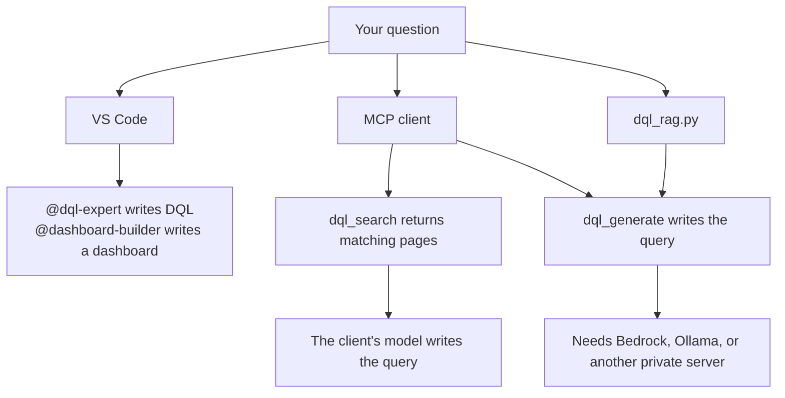

# Dynatrace DQL Knowledge Base

Models often write DQL that Dynatrace rejects: `fetch` on a metric, `by:` without braces, SQL keywords, made-up metric keys. This repo is the reference that keeps the query valid. Use it from VS Code, from any MCP client, or from the command line.



It is built for an enterprise desktop you do not administer, where `pip install` and Docker Hub are blocked. Nothing here calls a public model API unless you point it at one.

| Path | Who writes the DQL | Install |
|------|--------------------|---------|
| [Copilot agents](#github-copilot-agents) | The model in the IDE | None |
| [`dql_agent.sh`](#ask-your-tenant-through-bedrock) | A Bedrock model, which also runs the query on your tenant and answers from the records | None; needs an AWS account with Bedrock |
| [`dql_search`](#mcp-server) | Your MCP client's model, using the snippets | Docker, or `./quickstart.sh --with-rag` |
| [`dql_generate` and `dql_rag.py query`](#generating-queries-outside-the-ide) | The model you configure | Same, plus Bedrock, Ollama, or another private server |

[ARCHITECTURE.md](ARCHITECTURE.md) explains how the pieces fit together.

## Quick start

```bash
git clone https://github.com/aachtenberg/dynatrace-dql-kb.git
cd dynatrace-dql-kb
./quickstart.sh                 # checks that Python 3.10+ starts; installs nothing
cp .env.example .env            # set DT_ENVIRONMENT_URL and DT_API_TOKEN
./dt_fetch.sh test              # one small query to check the token
./dt_fetch.sh all               # write your tenant's metric keys and field names into docs/
```

Then open the folder in VS Code. The Copilot agents need nothing else.

On Windows Git Bash, `python3` is often the Microsoft Store alias; the scripts skip it and use `python` or `py -3`.

## Ask your tenant through Bedrock

`./dql_agent.sh` puts a model on Amazon Bedrock in a loop with three tools: search the docs, look up the tenant's real metric keys and field names, and run DQL on your tenant. When Grail rejects a query, the model reads the error and fixes it. When the query runs, it answers from the records, not from memory. It uses only the Python standard library — requests to Bedrock are signed without `boto3` — so it runs on a locked-down desktop or in AWS CloudShell.

```bash
# in .env, next to DT_ENVIRONMENT_URL and DT_API_TOKEN
BEDROCK_MODEL_ID=us.anthropic.claude-sonnet-4-5-20250929-v1:0
BEDROCK_REGION=us-east-1
```

```bash
./dql_agent.sh --check        # AWS credentials, model access, tenant — says which one fails
./dql_agent.sh                # interactive; /help lists the commands
./dql_agent.sh "which hosts had CPU above 90% in the last hour?"
```

```
dql> which hosts had CPU above 90% in the last hour?
  · search_docs: timeseries cpu usage by host
  · find_names: host cpu
  · run_dql:
      timeseries usage=avg(dt.host.cpu.usage, scalar:true), by:{dt.entity.host}, from:-1h
      | filter usage > 90
  Run this query? [Y/n]
    2 records, 117.7 MB scanned
```

- **You approve every query** before it runs, unless you pass `--yes` or type `/auto`. `--no-run` only writes queries. Without `DT_ENVIRONMENT_URL` it writes queries and does not run them.
- **Cost guard:** each query is capped at 50 GB scanned (`DQL_AGENT_SCAN_LIMIT_GB`), and the scanned size is shown after it runs.
- **AWS credentials** are read from `AWS_ACCESS_KEY_ID` / `AWS_SECRET_ACCESS_KEY` / `AWS_SESSION_TOKEN`, then `~/.aws/credentials` (`AWS_PROFILE`), then `aws configure export-credentials` if the AWS CLI is installed (SSO and assumed roles). A Bedrock API key in `AWS_BEARER_TOKEN_BEDROCK` also works. The identity needs `bedrock:InvokeModel` on the model.
- **What leaves the machine:** your question, doc excerpts, and up to 50 records per query go to Bedrock in your AWS account. Nothing goes to a public model API.
- Run `./dt_fetch.sh all` first. The agent checks names against `docs/metric_keys.md` and `docs/entity_schemas.md`, so it is only as good as those two files.

## GitHub Copilot agents

Open the repo in VS Code with Copilot enabled and call an agent from Copilot Chat.

**`@dql-expert`** writes DQL and knows the rules models get wrong: metrics use `timeseries`, never `fetch`; `by:` needs braces; no SQL; `makeTimeseries` is for logs, events and spans only.

```
@dql-expert show me hosts with CPU above 90% in the last hour
@dql-expert error logs from the payment service grouped by host
@dql-expert week-over-week CPU comparison
```

**`@dashboard-builder`** writes a dashboard for the current Dashboards app (not Classic) as JSON, including the tile types, the grid, and Terraform `dynatrace_document`.

```
@dashboard-builder create a host overview dashboard with CPU, memory, and error logs
@dashboard-builder add a single-value tile showing total error count
```

Copilot picks these files up automatically:

| File | When it applies |
|------|-----------------|
| `.github/copilot-instructions.md` | Every Copilot request |
| `.github/instructions/dql.instructions.md` | Editing `.dql` or `.md` files |
| `.github/instructions/dashboard.instructions.md` | Editing dashboard JSON |
| `.github/agents/dql-expert.md`, `dashboard-builder.md` | `@dql-expert`, `@dashboard-builder` in Chat |

In Agent Mode, Copilot can also search `docs/`.

## Knowledge base

| File in `docs/` | What's in it |
|------|-------------|
| `dql_syntax_reference.md` | Commands, functions, operators, data types |
| `dql_example_queries.md` | Working queries: hosts, logs, spans, Kubernetes, entities |
| `kubernetes.md` | Container CPU, restarts, and how to tell a cluster is k3s |
| `dql_tips_and_patterns.md` | Common mistakes and how to avoid them |
| `dql_wrong_vs_right.md` | Wrong→right pairs for the mistakes models make |
| `dashboard_json_schema.md` | Dashboard JSON, tile types, visualizations, Terraform |
| `metric_keys.md` | **Your tenant's** metric keys |
| `entity_schemas.md` | **Your tenant's** entity, log and span fields |

To add your own material — team queries, runbook snippets — drop `.md`, `.txt`, `.dql`, `.json`, `.yaml` or `.yml` files into `docs/`.

### Filling in your tenant's data

The grammar is generic, but metric keys and field names differ per tenant, and models make them up. `./dt_fetch.sh all` writes both files from the Grail API. It uses only the Python standard library.

`.env` (real environment variables also work; `.env` is gitignored):

| Variable | Value |
|----------|-------|
| `DT_ENVIRONMENT_URL` | `https://<env-id>.apps.dynatrace.com`, no path. The `live.dynatrace.com` host returns 404 on the Grail query API. |
| `DT_API_TOKEN` | A platform token (`dt0s16…`) from the same environment. A classic `dt0c01…` token also works. |

The token needs `storage:metrics:read`, `storage:entities:read`, `storage:logs:read`, `storage:events:read`, `storage:bizevents:read`, `storage:spans:read` and `storage:buckets:read`. A corporate proxy is read from `HTTPS_PROXY`. If TLS inspection breaks certificate checks, set `SSL_CERT_FILE` to your company CA bundle.

Without API access, run these in a Dynatrace Notebook and paste the results into the two files:

```
metrics | sort metric.key asc          -- into docs/metric_keys.md

describe dt.entity.host                -- these into docs/entity_schemas.md
describe dt.entity.service
describe dt.entity.process_group
describe logs
describe events
describe spans
describe bizevents
```

## MCP server

The container runs an [MCP](https://modelcontextprotocol.io) server that Claude Code, Claude Desktop, Cursor and other MCP clients pick up as tools:

| Tool | What it does |
|------|--------------|
| `dql_search(question)` | Returns the matching reference pages; your client's model writes the DQL. Always on, needs no key. |
| `dql_generate(question)` | Returns a finished query from the model you configure. Off until you [set a provider](#generating-queries-outside-the-ide). |

Build it where PyPI and Hugging Face are reachable, then copy the image across. The docs and the embedding model are baked in at build time, so the container starts quickly and runs with no network (checked with `docker run --network none`). The image is about 2.5 GB.

```bash
docker build -t dql-kb-mcp .
docker run --rm -i dql-kb-mcp     # stdio, so -i is required
```

Register it in your client's config (`claude_desktop_config.json`, Cursor `mcp.json`, …):

```jsonc
{
  "mcpServers": {
    "dql-kb": {
      "command": "docker",
      "args": ["run", "--rm", "-i", "dql-kb-mcp"]
    }
  }
}
```

**Without Docker:** `./quickstart.sh --with-rag` creates `.venv`, installs the CPU build of PyTorch (a plain `pip install` pulls the multi-gigabyte CUDA build) and the MCP SDK, and ingests the docs. On Debian/Ubuntu it needs `python3-venv` and `python3-pip`. With [`uv`](https://github.com/astral-sh/uv) instead: `uv venv && uv pip install -r requirements.txt && uv run python dql_rag.py ingest`.

## Generating queries outside the IDE

`dql_generate` and `python dql_rag.py query "…"` (or `interactive`) need a model. Set `LLM_PROVIDER` and its settings — as `-e` flags to `docker run`, or as environment variables for the CLI. With `LLM_PROVIDER` unset, generation stays off.

```bash
# Amazon Bedrock (Converse API)
LLM_PROVIDER=bedrock
BEDROCK_REGION=us-east-1
BEDROCK_MODEL_ID=us.anthropic.claude-sonnet-4-5-20250929-v1:0

# Ollama
LLM_PROVIDER=ollama
OLLAMA_BASE_URL=http://ollama.internal:11434
OLLAMA_MODEL=qwen3:8b
OLLAMA_NUM_CTX=16384

# vLLM
LLM_PROVIDER=vllm
VLLM_BASE_URL=http://vllm.internal:8000
VLLM_MODEL=your-served-model-name

# Any other server that speaks POST /v1/chat/completions
LLM_PROVIDER=openai_compatible
PRIVATE_BASE_URL=http://inference.internal:8080
PRIVATE_MODEL=your-model-name
```

- **Bedrock** signs requests with the standard AWS credential chain (IAM role, SSO session, or `AWS_*` variables — pass them into the container with `-e`). No key is stored in the repo. The identity needs `bedrock:InvokeModel` on the model. `BEDROCK_MODEL_ID` is usually a cross-region inference profile (`us.` or `eu.` prefix), not the bare foundation-model id.
- **Ollama** is called on its native `/api/chat`, because its `/v1` route ignores `num_ctx` and silently drops the retrieved pages. Which tag to run is in [evaluations/ollama-dql.md](evaluations/ollama-dql.md). From inside Docker on Linux, add `--add-host=host.docker.internal:host-gateway` or use the host's IP; Docker Desktop resolves `host.docker.internal` on its own.
- **vLLM and others:** the base URL may be the host root or end in `/v1`. Set `PRIVATE_API_KEY` only if the server checks a bearer token.

| Setting | Default | Notes |
|---------|---------|-------|
| `LLM_PROVIDER` | unset | `bedrock`, `ollama`, `vllm`, `openai_compatible` |
| `OLLAMA_MODEL` | `qwen3:8b` | Best tag in the 2026-09-24 evaluation |
| `OLLAMA_NUM_CTX` | `16384` | Ollama's default of 4096 truncates the prompt |
| `BEDROCK_MODEL_ID` | empty | Required for `bedrock` |
| `BEDROCK_REGION` | `AWS_REGION`, else `us-east-1` | |
| `EMBEDDING_MODEL` | `all-MiniLM-L6-v2` | Local sentence-transformer |
| `CHUNK_SIZE` / `CHUNK_OVERLAP` | `800` / `100` | Tokens |
| `TOP_K` | `10` | Chunks retrieved per question |

## Also in this repo

- **Trace profiler** — `./util/dt_trace_profiler.sh` ranks trace entry points and flags the ones that look like batch jobs. Standard library only. See [util/README.md](util/README.md).
- **Evaluations** — [evaluations/](evaluations/) holds model test results. It stays out of `docs/` so they are not ingested as DQL reference.
