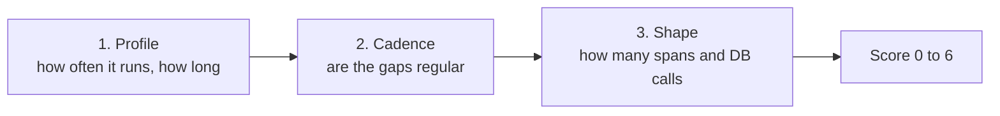

# Trace profiler

A utility, separate from the knowledge base and the MCP image. It ranks trace entry points by how often they run and flags the ones that look like batch jobs. The Python script reuses `dt_fetch.py`'s Grail client and `.env` config. Stdlib only — no virtualenv and no pip install. `util/dt_trace_profiler.sh` is a thin wrapper: it runs from the repo root and forwards every argument. It uses the first interpreter that actually starts (`python3`, then `python`, then `py -3`), so Git Bash skips the Microsoft Store `python3` alias and uses the real `python`.

```bash
./util/dt_trace_profiler.sh                         # 7-day lookback, writes dt_trace_profile.csv
./util/dt_trace_profiler.sh --days 3 --metric-counts
./util/dt_trace_profiler.sh --help                  # all options
```

Grail bills by data scanned, so each stage aggregates in DQL.



| Stage | What it does | Cost |
|-------|--------------|------|
| 1. Profile | Run count and p50/p95 duration per entry point (service + endpoint + span kind) | One aggregated query over the window |
| 2. Cadence | Root-span start times: how regular the gaps are, and how often a run starts on a minute boundary | One scan per batch of ~150 entry points, only inside the `--min-runs` / `--max-runs` band |
| 3. Shape | Span count and DB span count for the three most recent runs of the top candidates | Narrow windows sized from p95 duration |

Each entry point gets a 0-6 score: non-server root span (+1), clockwork cadence (+2, or +1 if merely regular), minute-aligned starts (+1), p50 over 30s (+1), high span or DB fan-out (+1). Cadence regularity is MAD/median of the gaps between runs, so missed runs and weekday-only schedules still read as regular. Random traffic lands around 0.6-0.7; scheduled jobs sit near 0. Parallel root spans starting within 5s of each other count as one run.

Required scopes: `storage:spans:read`, `storage:buckets:read`, plus `storage:metrics:read` for `--metric-counts`.

Things to know:

- **Span counts are sampled.** Adaptive capture drops traces on busy endpoints, so stage 1 undercounts the hottest ones. `--metric-counts` adds unsampled counts from `dt.service.request.count`. The endpoint dimension on that metric has changed across Dynatrace versions, so this stage fails soft if the query errors.
- **Root definition.** The default `--root-filter` is `isNull(span.parent_id)`, meaning true trace roots. If an upstream system propagates W3C trace context into your services, jobs it triggers won't be roots; use `--root-filter 'request.is_root_span == true'` to profile per-service entry points instead.
- **Retention.** Keep `--days` within your span retention. For weekly or monthly jobs, keep the CSVs from successive runs rather than widening the lookback.
- **500 GB scan stop.** Grail cancels a `fetch` that would read more than 500 GB. A no-arg 7-day span scan crosses that on a busy tenant, so the profiler sends the cap as a curly-brace group, `{scanLimitGBytes: -1}`, which reads the whole window. `--scan-limit-gb 500` puts the stop back. That full scan is billable.
- **Truncation.** Grail notifications print to stderr. If stage 2 reports truncation, lower `--batch-size`; a truncated batch understates run counts. A scan-limit stop aborts the run instead of writing a partial CSV.
- **The CSV contains real service and endpoint names.** It is gitignored; don't commit it.
- **Field names** assume OneAgent spans (`dt.entity.service`, `endpoint.name`, `db.system`, `span.kind`) with `coalesce` fallbacks for OTel `service.name` / `span.name`. Check [`docs/entity_schemas.md`](../docs/entity_schemas.md) for your tenant after running `dt_fetch.py schemas`.

The strongest validation is joining the output against your job scheduler's run history on host and start time. Entry points that score high but match no scheduled job are usually undocumented cron jobs or in-app timers.
